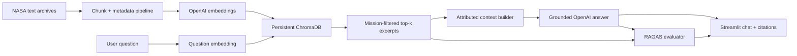

# NASA Mission Intelligence

NASA Mission Intelligence is an end-to-end retrieval-augmented generation (RAG)
application for exploring primary-source records from Apollo 11, Apollo 13, and the
STS-51-L Challenger mission. It turns mission reports, flight plans, technical records,
and transcripts into a searchable ChromaDB index, retrieves mission-specific evidence,
and asks an OpenAI model to answer with inline source citations.

The repository includes a Streamlit chat interface, real-time RAGAS scoring, and a batch
evaluation workflow covering mission overview, emergencies, disaster analysis, crew,
technical operations, and timeline reconstruction.

## Highlights

- Configurable character chunking with sentence-aware boundaries and exact overlap
- OpenAI `text-embedding-3-small` embeddings persisted in ChromaDB
- Stable document IDs and `skip`, `update`, and `replace` indexing modes
- Per-chunk mission, file, category, position, and processing metadata
- Top-k semantic retrieval with optional mission filtering
- Deduplicated, relevance-sorted context with explicit source labels
- A grounded NASA historian prompt with bounded conversation history
- RAGAS response relevancy and faithfulness scoring on every evaluated answer
- Additional lexical context precision and optional reference-answer token F1
- Six-question batch dataset with per-question and aggregate reports
- Focused tests that run without an API key or network access

## Architecture



The embedding function is attached to the Chroma collection during both indexing and
retrieval. This guarantees that document and question vectors use the model recorded in
the collection metadata.

## Repository Layout

```text
.
├── batch_evaluate.py          # End-to-end batch evaluation CLI
├── chat.py                    # Streamlit interface
├── data_text/                 # Included NASA mission records
│   ├── apollo11/
│   ├── apollo13/
│   └── challenger/
├── embedding_pipeline.py      # Chunking, embedding, persistence, and stats
├── evaluation_dataset.txt     # JSON-formatted, rubric-spanning test questions
├── llm_client.py              # Grounded answer generation
├── rag_client.py              # Backend discovery, retrieval, and context formatting
├── ragas_evaluator.py         # Real-time quality metrics
├── requirements.txt           # Runtime dependencies
├── requirements-dev.txt       # Runtime plus test/lint tooling
└── tests/                     # Focused offline tests
```

Generated Chroma databases, logs, virtual environments, local secrets, and evaluation
reports are intentionally excluded from version control.

## Requirements

- Python 3.10 or newer
- An OpenAI API key with access to an embedding model and a chat-completions model
- Internet access while building the index, generating answers, or running RAGAS

The pinned `langchain-community==0.4.1` dependency is deliberate. RAGAS 0.4.3 imports a
compatibility module removed in `langchain-community` 0.4.2.

## Quick Start

### 1. Create an environment

```bash
python -m venv .venv
```

Activate it on macOS or Linux:

```bash
source .venv/bin/activate
```

Activate it in PowerShell:

```powershell
.\.venv\Scripts\Activate.ps1
```

Install the application:

```bash
python -m pip install -r requirements.txt
```

### 2. Set the API key

macOS or Linux:

```bash
export OPENAI_API_KEY="your-key"
```

PowerShell:

```powershell
$env:OPENAI_API_KEY = "your-key"
```

The Streamlit interface also accepts the key in a password field. Never commit a key;
`.env`, Streamlit secrets, and common local credential files are ignored.

### 3. Build the vector index

```bash
python embedding_pipeline.py \
  --data-path ./data_text \
  --chroma-dir ./chroma_db_openai \
  --collection-name nasa_space_missions_text \
  --chunk-size 1000 \
  --chunk-overlap 200 \
  --update-mode skip
```

The command scans all three mission folders, embeds each chunk, and prints file, chunk,
mission, and collection totals. A first run makes paid OpenAI embedding requests.

### 4. Launch the application

```bash
streamlit run chat.py
```

Open the local URL printed by Streamlit. Choose a mission scope, retrieval depth, and
answer model, then ask a question. Enabling RAGAS adds evaluator requests and latency.

## Indexing and Inspection

The important pipeline flags are:

| Flag | Purpose | Default |
| --- | --- | --- |
| `--data-path` | Directory containing mission folders | `./data_text` |
| `--chroma-dir` | Persistent ChromaDB directory | `./chroma_db_openai` |
| `--collection-name` | Collection to create or reuse | `nasa_space_missions_text` |
| `--embedding-model` | OpenAI embedding model | `text-embedding-3-small` |
| `--chunk-size` | Maximum characters per chunk | `1000` |
| `--chunk-overlap` | Shared characters between consecutive chunks | `200` |
| `--batch-size` | Embeddings written per batch | `50` |
| `--update-mode` | Existing-content policy | `skip` |
| `--stats-only` | Print collection aggregates without embedding | off |
| `--test-query` | Run a semantic query after indexing | unset |

Update modes have intentionally different semantics:

- `skip` embeds only missing stable IDs and leaves existing chunks untouched.
- `update` upserts current chunks and deletes stale chunks when a file becomes shorter.
- `replace` prepares all new embeddings before deleting that file's existing chunks,
  reducing the risk of data loss when an embedding request fails.

Inspect an existing collection without an API call:

```bash
python embedding_pipeline.py \
  --chroma-dir ./chroma_db_openai \
  --collection-name nasa_space_missions_text \
  --stats-only
```

Run a retrieval smoke query after indexing:

```bash
python embedding_pipeline.py \
  --data-path ./data_text \
  --chroma-dir ./chroma_db_openai \
  --update-mode skip \
  --test-query "What problems did Apollo 13 encounter?"
```

## Evaluation

`evaluation_dataset.txt` is JSON-formatted text containing six questions and concise
reference answers. It spans all three missions and the required categories:

- overview
- emergency
- disaster analysis
- crew
- technical
- timeline

Run the complete evaluation after building the Chroma collection:

```bash
python batch_evaluate.py \
  --chroma-dir ./chroma_db_openai \
  --collection-name nasa_space_missions_text \
  --output ./evaluation_report.json
```

The report contains the answer, retrieved sources, scores, errors, and mean score for
each metric. `evaluation_report.json` is a generated artifact and should not be committed.
Use `--limit 1` for a lower-cost smoke run.

### Metrics

- **Response relevancy:** RAGAS generates candidate questions from the response and
  compares them semantically with the original question.
- **Faithfulness:** RAGAS decomposes the response into claims and checks those claims
  against the retrieved excerpts.
- **Lexical context precision:** the fraction of meaningful answer tokens present in
  retrieved context; this is transparent and deterministic, not a substitute for RAGAS.
- **Reference token F1:** optional overlap with the dataset reference answer during batch
  evaluation.

## Testing and Quality Checks

Install development dependencies:

```bash
python -m pip install -r requirements-dev.txt
```

Run the same checks as continuous integration:

```bash
ruff check .
pytest
```

The tests cover chunk bounds and overlap, stable IDs, mission metadata, mission-filtered
retrieval, top-k limits, context sorting and deduplication, prompt construction, evaluator
input errors, lexical metrics, and dataset integrity. OpenAI and Chroma calls are isolated
with lightweight fakes where appropriate.

## Design Decisions

### Character-bounded chunks

The rubric constrains maximum chunk size in characters or tokens. Character bounds make
that invariant directly testable and independent of tokenizer versions. The pipeline seeks
a nearby paragraph or sentence boundary but always advances from the prior chunk end minus
the configured overlap, so consecutive chunks share exactly the requested number of
characters.

### Stable source identity

Chunk IDs combine mission, source, a short normalized-path digest, and chunk index. This
keeps IDs readable while avoiding collisions between similarly named files. The ID scheme
enables idempotent indexing and predictable update behavior.

### Grounding boundary

Retrieved content is labeled as quoted evidence and fenced from the current question. The
system prompt requires citations, prohibits unsupported memory-based additions, and tells
the model to treat instructions embedded in source documents as data. Conversation history
is limited to the last eight valid user or assistant turns; retrieval context is fresh for
every request.

### Evaluation is optional in chat

RAGAS is valuable but uses additional LLM and embedding calls. The chat application leaves
it off by default and makes the cost/latency tradeoff visible. Batch evaluation enables it
for every dataset record.

## Limitations

- Results depend on OCR and transcript quality in the supplied archives.
- The included Challenger corpus is mission audio, not the complete accident investigation;
  answers about root cause should therefore acknowledge missing evidence.
- Local ChromaDB persistence is intended for a single-user portfolio application, not a
  distributed production service.
- OpenAI service availability, model access, and account budget are external dependencies.
- A complete live batch evaluation incurs API cost and cannot be reproduced offline; the
  deterministic test suite validates orchestration without claiming model-quality scores.

## Data and Attribution

The project is based on Udacity's NASA Mission Intelligence educational starter and uses
the NASA text records bundled with that material. The upstream educational-content license
is reproduced in [LICENSE.md](LICENSE.md). NASA-origin materials are retained as source
evidence; this repository does not claim authorship of those records.

## Possible Extensions

- Hybrid lexical/vector retrieval with a reranking stage
- Streaming responses and token/cost telemetry
- Automated regression thresholds for saved evaluation reports
- Containerized deployment with a managed vector store
- Page- or timestamp-level deep links into source documents
