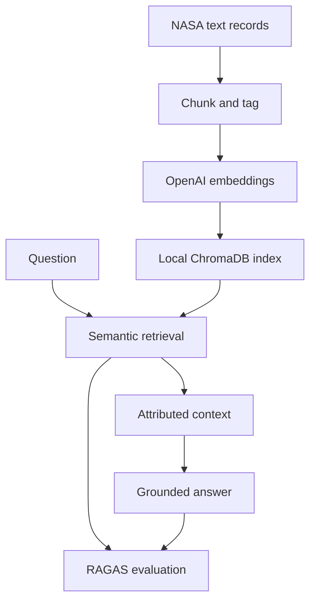

# NASA Mission Intelligence

NASA Mission Intelligence is a retrieval-augmented generation application for exploring
records from Apollo 11, Apollo 13, and STS-51-L Challenger. It turns mission transcripts,
flight plans, and technical reports into a searchable local archive, then uses the most
relevant passages to answer questions with inline source citations.

The project combines an OpenAI embedding and chat workflow with ChromaDB, a Streamlit
interface, and RAGAS evaluation. The emphasis is on traceable answers: retrieval can be
limited to one mission, every response is grounded in the selected excerpts, and the
supporting text remains visible alongside the answer.

## How it works



The indexing pipeline creates character-bounded, overlapping chunks and records their
mission, source path, document category, and position. At question time, the application
embeds the query, retrieves the closest chunks, removes duplicate passages, and orders the
remaining evidence by distance. A bounded conversation history gives follow-up questions
continuity without reusing stale retrieval context.

The interface supports:

- mission-specific or cross-mission search;
- configurable retrieval depth and answer model;
- cited answers with expandable source excerpts; and
- optional response-relevancy and faithfulness scores after each answer.

## Quick start

Python 3.10 or newer and an OpenAI API key are required for indexing and answering
questions.

```bash
git clone https://github.com/devin-thomas/nasa-rag.git
cd nasa-rag
python -m venv .venv
```

Activate the environment on macOS or Linux:

```bash
source .venv/bin/activate
```

Or in PowerShell:

```powershell
.\.venv\Scripts\Activate.ps1
```

Install the runtime dependencies:

```bash
python -m pip install -r requirements.txt
```

Set the API key in the current shell:

```bash
export OPENAI_API_KEY="your-key"
```

```powershell
$env:OPENAI_API_KEY = "your-key"
```

Build the local index:

```bash
python embedding_pipeline.py \
  --data-path ./data_text \
  --chroma-dir ./chroma_db_openai \
  --collection-name nasa_space_missions_text
```

Then launch the chat application:

```bash
streamlit run chat.py
```

The first index build sends the included source chunks to the OpenAI embeddings API.
Generated databases, reports, local environments, and secrets are excluded from version
control.

## Make shortcuts

The repository includes a `Makefile` for the common local workflow:

```bash
make install   # install runtime dependencies
make index     # build or update the local ChromaDB index
make stats     # inspect the indexed collection without API calls
make run       # launch the Streamlit app
make evaluate  # run batch retrieval, generation, and scoring
make test      # run the offline test suite
```

These commands use the default Chroma directory and collection name from the README examples.

## Docker

Docker is optional, but useful for users who want a repeatable Streamlit runtime without
managing local Python packages. The OpenAI API key still needs to be supplied through the
environment, and the ChromaDB folder should be mounted so the local index survives container
restarts.

Create a local `.env` file with:

```env
OPENAI_API_KEY=your-key
```

Build the image:

```bash
make docker-build
```

Build the local index on the host first:

```bash
make index
```

Run the app in Docker:

```bash
make docker-run
```

The app will be available at `http://localhost:8501`.

## Index maintenance

The pipeline can be rerun safely as the source collection changes. Its three update modes
serve different needs:

- `skip` adds only chunks whose stable IDs are not already present;
- `update` upserts current chunks and removes stale chunks for each processed file; and
- `replace` embeds a file's new chunks before replacing its previous entries.

Chunk size, overlap, batch size, embedding model, Chroma directory, and collection name are
all configurable CLI options. To inspect an existing collection without making an API
request:

```bash
python embedding_pipeline.py \
  --chroma-dir ./chroma_db_openai \
  --collection-name nasa_space_missions_text \
  --stats-only
```

This prints the collection size plus source, mission, data-type, and document-category
aggregates.

## Evaluation

[`evaluation_dataset.txt`](evaluation_dataset.txt) contains six questions spanning mission
overview, emergency response, disaster analysis, crew roles, technical operations, and
timeline reconstruction. Run the full retrieval, generation, and evaluation path with:

```bash
python batch_evaluate.py \
  --chroma-dir ./chroma_db_openai \
  --collection-name nasa_space_missions_text \
  --output ./evaluation_report.json
```

Each record includes the generated answer, retrieved sources, and scores. The summary
reports mean values for:

- RAGAS response relevancy;
- RAGAS faithfulness;
- lexical context precision; and
- reference-answer token F1.

RAGAS makes additional model and embedding requests. `--limit 1` is useful for a lower-cost
smoke run before evaluating the complete dataset.

## Project structure

```text
.
├── batch_evaluate.py          # Batch retrieval, generation, and scoring
├── chat.py                    # Streamlit user interface
├── data_text/                 # Apollo 11, Apollo 13, and Challenger records
├── embedding_pipeline.py      # Chunking, metadata, embeddings, and persistence
├── evaluation_dataset.txt     # Questions and reference answers
├── llm_client.py              # Grounded response generation
├── rag_client.py              # Collection discovery and semantic retrieval
├── ragas_evaluator.py         # RAGAS and deterministic evaluation metrics
├── Dockerfile                 # Optional containerized Streamlit runtime
├── Makefile                   # Local workflow shortcuts
└── tests/                     # Focused offline tests
```

## Development

Install the development dependencies and run the same checks used in CI:

```bash
python -m pip install -r requirements-dev.txt
ruff check .
pytest
```

The tests use small fakes for external services, so they validate chunking, index update
behavior, retrieval filters, context formatting, prompt construction, and evaluation data
without an API key.

## Design notes and limits

Character-based chunk limits keep chunk size predictable without coupling the pipeline to
a particular tokenizer. Stable IDs make repeated indexing idempotent, while preparing
embeddings before destructive replacement reduces the chance of losing an existing file
when an API request fails.

Answers are only as complete as the bundled evidence. OCR errors and transcript noise can
affect retrieval, and the Challenger material consists of mission audio rather than the
full accident investigation. The application therefore asks the model to state when the
retrieved context is insufficient instead of filling gaps from general knowledge.

ChromaDB persistence is designed for local, single-user use. Live answer quality also
depends on OpenAI model access, service availability, and account budget.

## Data and license

This project was developed from Udacity's NASA Mission Intelligence starter material. The
included NASA records remain source evidence and are not presented as original project
content. See [`LICENSE.md`](LICENSE.md) for the educational-content license and usage
conditions.
